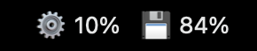
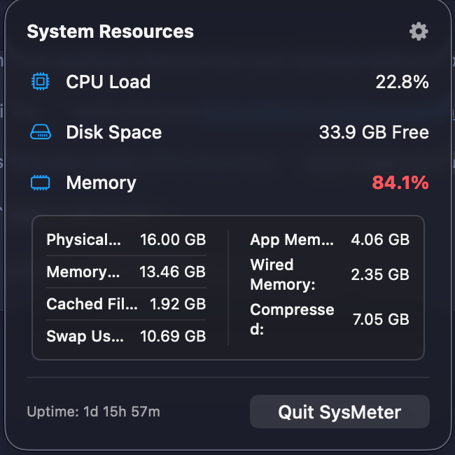
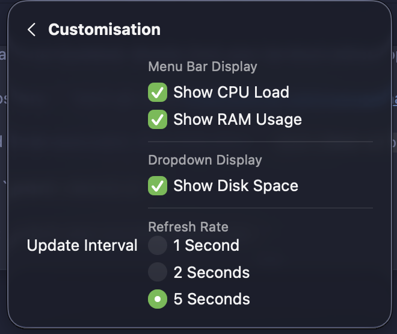

# sysMeter — Real-time System Monitoring

sysMeter is a lightweight, native macOS menu bar application for real-time system resource monitoring. Written in SwiftUI, it combines low-level Mach kernel APIs with modern glassmorphism design to provide instant CPU, memory, and disk insights without ever touching your dock.

## Features
* **Real-time Monitoring**: CPU load, RAM usage, and disk space with 1-5 second refresh intervals
* **Glassmorphism UI**: Modern frosted glass design with Tokyo Night color theme support
* **Low-Level Accuracy**: Direct Mach kernel APIs (`host_processor_info`, `host_statistics64`) for true hardware metrics
* **Detailed Memory Breakdown**: Physical, app, wired, compressed, and swap memory at a glance
* **Theme Support**: System, light, and dark modes with optional Tokyo Night preset
* **Tab Navigation**: Clean Monitor and Settings views with persistent tab bar
* **Auto-Updates**: Built-in check for updates via GitHub Releases
* **Terminal-only Build**: No Xcode needed — compile and install entirely from shell

## Requirements
* macOS 13.0 (Ventura) or later
* Swift 5.7+ (Included with Xcode Command Line Tools)

## Preview 


### Expanded view


## Customization 


## Installation & Setup

Build and install sysMeter directly from your terminal — no Xcode required.

1. **Clone the repository:**
   ```bash
   git clone https://github.com/BogdanAlinTudorache/sysMeter.git
   cd sysMeter/sysMeter
   ```

2. **Make the build script executable (first time only):**
   ```bash
   chmod +x build.sh
   ```

3. **Build, install, and launch:**
   ```bash
   ./build.sh
   ```

   The script automatically:
   - Compiles Swift source
   - Creates the app bundle
   - Installs to `/Applications/sysMeter.app`
   - Launches the app

## Usage

Click the sysMeter icon in your menu bar to open the monitoring window:

- **Monitor View**: Real-time CPU, memory, and disk metrics with color-coded thresholds
- **Settings**: Customize display toggles, refresh rate, theme, and color preset
- **Tab Navigation**: Switch between Monitor and Settings tabs at the top
- **Auto-save**: All preferences stored in macOS `UserDefaults` and persist across restarts

## Customization

Open Settings (gear icon in tab bar) to:
- Toggle CPU, RAM, and disk display in menu bar and dropdown
- Set refresh rate (1s, 2s, or 5s)
- Choose theme: System, Light, or Dark
- Select color preset: Default or Tokyo Night

## Updates

sysMeter has built-in update checking. In the Settings view, click "Check for Updates" to see if a newer version is available on GitHub Releases. Updates are semantic versioned (MAJOR.MINOR.PATCH).

## Architecture

- **Single-file design**: All SwiftUI code in `main.swift`
- **No dependencies**: Pure Swift with only macOS frameworks
- **Efficient polling**: Low-overhead Mach kernel calls (1-5 second intervals)
- **Local-only**: All data computed locally — nothing sent to external services

## License

This project is open source and available under the MIT License.
